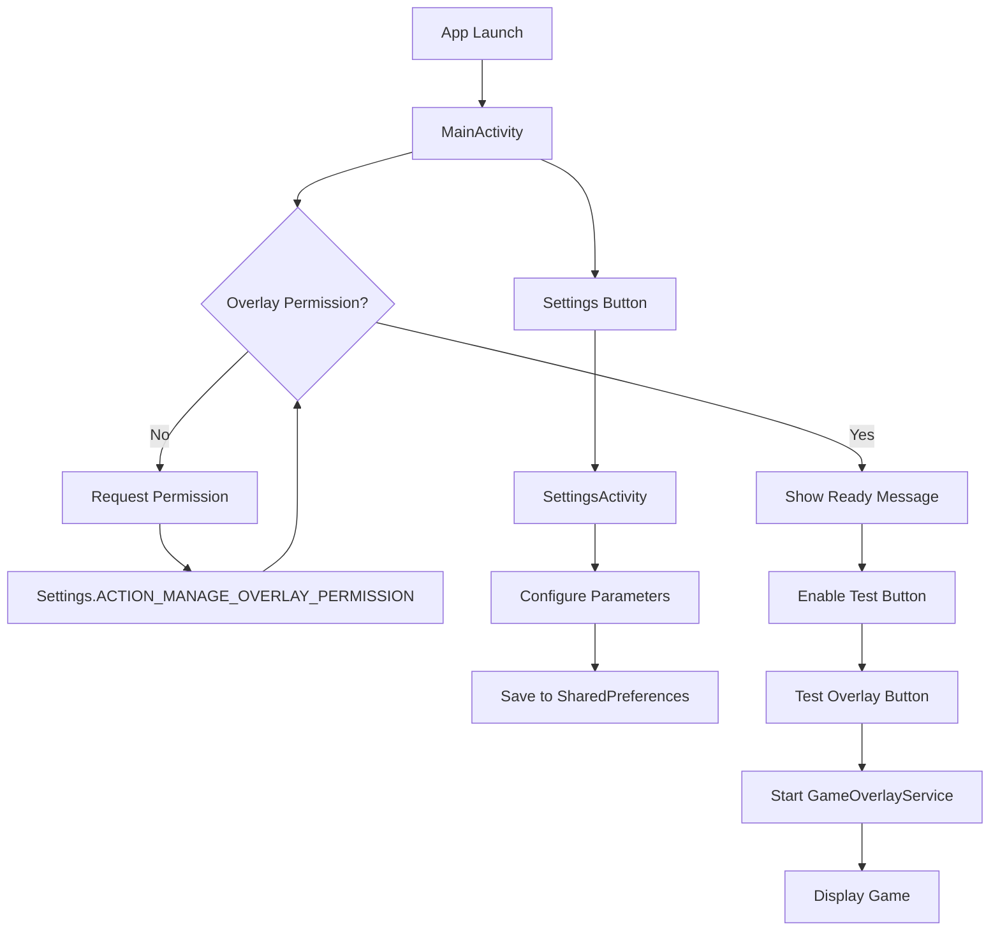
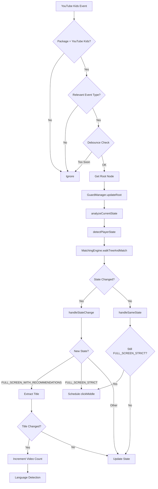
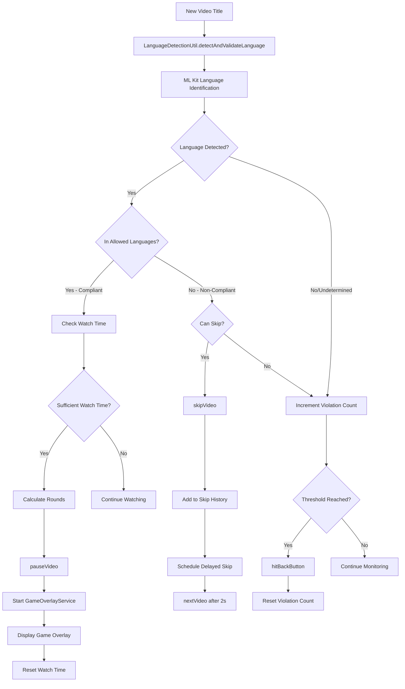
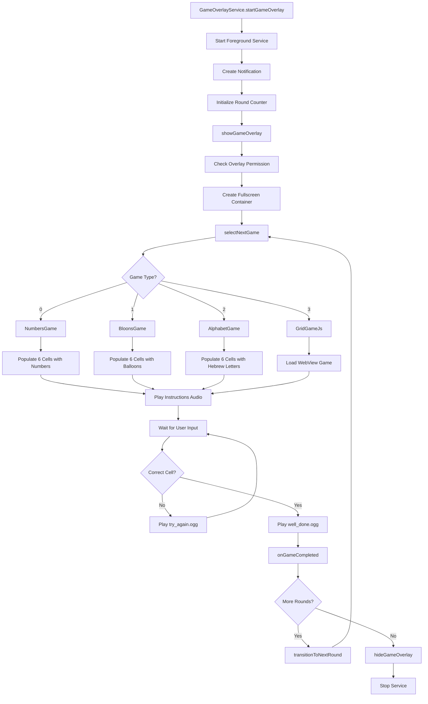
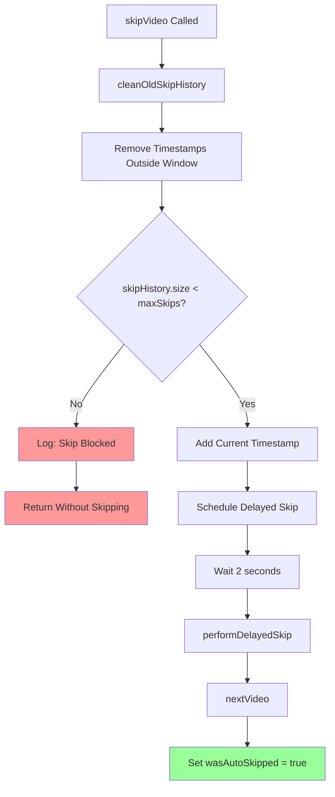
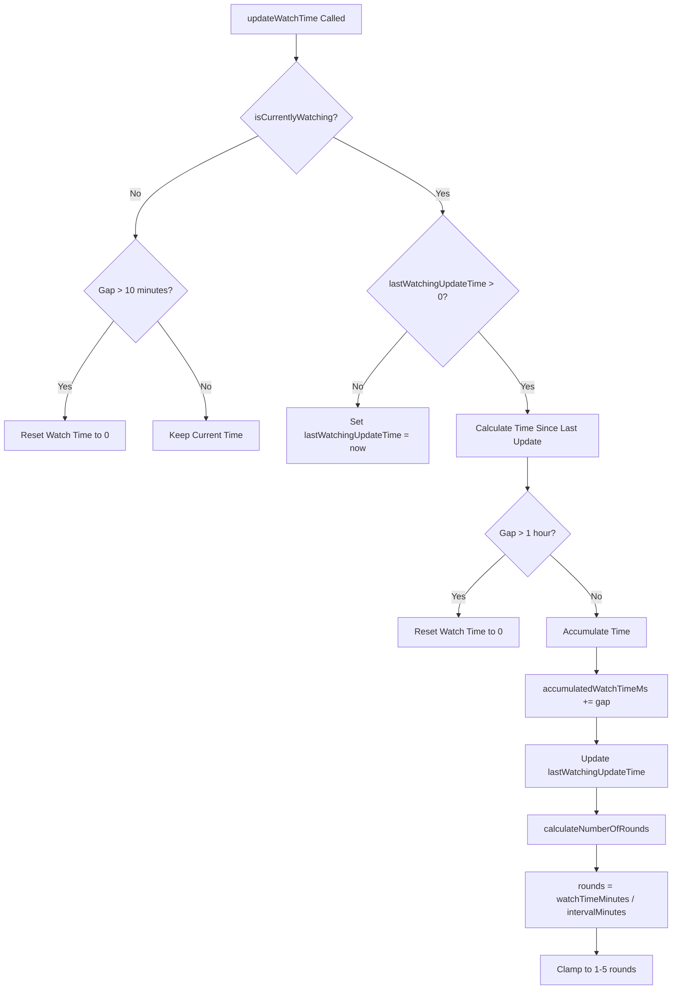

# PlayAndThen - Comprehensive Technical Documentation

## Table of Contents
1. [Overview](#overview)
2. [Architecture](#architecture)
3. [Core Components](#core-components)
4. [Features](#features)
5. [Program Flow](#program-flow)
6. [Configuration](#configuration)
7. [Setup & Installation](#setup--installation)

---

## Overview

**PlayAndThen** is an Android parental control application designed for YouTube Kids that combines educational gaming with content monitoring. The app intercepts video playback to display interactive educational games while simultaneously monitoring video content language and enforcing viewing policies through rate limiting.

### Key Capabilities
- **Accessibility Service Integration**: Monitors YouTube Kids activity in real-time
- **Educational Game Overlays**: Three game types (Numbers, Hebrew Alphabet, Balloons)
- **ML-Powered Language Detection**: Uses Google ML Kit to detect video language
- **Smart Rate Limiting**: Prevents excessive content skipping
- **Configurable Parental Controls**: Customizable thresholds and intervals

---

## Architecture

### High-Level Architecture

```
┌─────────────────────────────────────────────────────────────┐
│                      PlayAndThen App                         │
├─────────────────────────────────────────────────────────────┤
│                                                               │
│  ┌──────────────┐    ┌──────────────┐    ┌──────────────┐  │
│  │   MainActivity│    │SettingsActivity│   │ GameOverlay  │  │
│  │              │    │              │    │   Service    │  │
│  │  - Permissions│    │ - Config UI  │    │ - Game Views │  │
│  │  - Test Games│    │ - SharedPrefs│    │ - Foreground │  │
│  └──────────────┘    └──────────────┘    └──────────────┘  │
│                                                               │
│  ┌─────────────────────────────────────────────────────┐    │
│  │           GuardService (Accessibility)               │    │
│  │  ┌────────────────────────────────────────────┐     │    │
│  │  │         GuardManager (Core Logic)          │     │    │
│  │  │  - State Management                        │     │    │
│  │  │  - Video Detection                         │     │    │
│  │  │  - Rate Limiting                           │     │    │
│  │  │  - Watch Time Tracking                     │     │    │
│  │  └────────────────────────────────────────────┘     │    │
│  └─────────────────────────────────────────────────────┘    │
│                                                               │
│  ┌──────────────┐    ┌──────────────┐    ┌──────────────┐  │
│  │MatchingEngine│    │LanguageDetect│    │ButtonExtractor│ │
│  │              │    │     Util     │    │              │  │
│  │ - Tree Walk  │    │  - ML Kit    │    │ - UI Actions │  │
│  └──────────────┘    └──────────────┘    └──────────────┘  │
│                                                               │
└─────────────────────────────────────────────────────────────┘
                            │
                            ▼
                  ┌──────────────────┐
                  │  YouTube Kids    │
                  │  (Monitored App) │
                  └──────────────────┘
```

### Component Interaction Flow

```
User Opens YouTube Kids
         │
         ▼
┌────────────────────┐
│  GuardService      │ ◄─── Accessibility Events
│  (Background)      │
└────────────────────┘
         │
         ▼
┌────────────────────┐
│  GuardManager      │
│  - Analyzes Tree   │
│  - Detects State   │
│  - Extracts Title  │
└────────────────────┘
         │
         ├─────────────────┐
         ▼                 ▼
┌──────────────┐   ┌──────────────┐
│LanguageDetect│   │MatchingEngine│
│     Util     │   │              │
└──────────────┘   └──────────────┘
         │
         ▼
   Decision Logic
         │
    ┌────┴────┐
    ▼         ▼
Compliant  Non-Compliant
    │         │
    ▼         ▼
Show Game  Skip Video
```

---

## Core Components

### 1. GuardService (Accessibility Service)

**Purpose**: Monitors YouTube Kids accessibility events and delegates processing to GuardManager.

**Key Responsibilities**:
- Receives accessibility events from YouTube Kids
- Debounces noisy events (5ms cooldown)
- Provides accessibility tree root to GuardManager
- Logs accessibility tree for debugging

**Lifecycle**:
```
onServiceConnected() → Initialize GuardManager
         ↓
onAccessibilityEvent() → Filter & Debounce → Update GuardManager
         ↓
onDestroy() → Cleanup GuardManager
```

### 2. GuardManager (Core Logic)

**Purpose**: Central state management and decision-making engine.

**State Tracking**:
- Current player state (NONE, MINI_PLAYER, FULL_SCREEN_WITH_RECOMMENDATIONS, FULL_SCREEN_STRICT)
- Video title and detected language
- Skip history with timestamps
- Language violation counter
- Accumulated watch time
- Daily video count

**Key Methods**:
| Method | Purpose |
|--------|---------|
| `updateRoot()` | Processes new accessibility tree |
| `analyzeCurrentState()` | Detects state changes and extracts info |
| `skipVideo()` | Skips to next video with rate limiting |
| `pauseVideo()` | Pauses current video |
| `hitBackButton()` | Returns to YouTube Kids home |
| `clickMiddle()` | Triggers center screen tap (for auto-play) |

**Configuration Integration**:
```kotlin
getMaxSkipsInTimeWindow()        // Default: 5 skips
getSkipTimeWindowMinutes()        // Default: 10 minutes
getLanguageViolationThreshold()   // Default: 3 violations
getGameOverlayIntervalMinutes()   // Default: 15 minutes
```

### 3. MatchingEngine

**Purpose**: Efficiently matches multiple node patterns against accessibility tree in a single traversal.

**Algorithm**:
```
walkTreeAndMatch(root, matchers):
    matched = Array(matchers.size) { null }
    
    walkTree(node):
        for each matcher:
            if not matched and matcher.isMatch(node):
                matched[i] = matcher
        
        if all matched:
            return true
        
        for each child:
            walkTree(child)
    
    return matched
```

**Supported Matchers**:
- `MiniPlayerMatcher`: Detects minimized video player
- `FullScreenVideoMatcher`: Detects full-screen with recommendations
- `StrictFullScreenVideoMatcher`: Detects strict full-screen mode

### 4. LanguageDetectionUtil

**Purpose**: ML-powered language detection using Google ML Kit.

**Allowed Languages**:
- English (en)
- Hebrew (he)
- Russian (ru)

**Detection Flow**:
```
detectAndValidateLanguage(title, callback):
    LanguageIdentifier.identifyLanguage(title)
        ↓
    Success → languageCode
        ↓
    Check if in ALLOWED_LANGUAGES
        ↓
    callback(languageCode, isCompliant)
```

**Confidence Threshold**: 0.5 (50%)

### 5. GameOverlayService

**Purpose**: Displays educational game overlays as a foreground service.

**Features**:
- Multi-round game support (1-5 rounds)
- Fullscreen overlay with system UI blocking
- Foreground notification for Android O+
- Automatic service cleanup after completion

**Game Selection**:
```kotlin
selectNextGame(): Int {
    return (0..3).random()
    // 0 = NumbersGame
    // 1 = BloonsGame
    // 2 = AlphabetGame
    // 3 = GridGameJs (TypeScript/JavaScript)
}
```

### 6. Game Implementations

#### NumbersGame
- **Objective**: Find cell with target number (0-10)
- **UI**: 6 cells with colorful numbers
- **Audio**: Number pronunciation (zero.ogg - ten.ogg)

#### AlphabetGame
- **Objective**: Find cell with target Hebrew letter (א-י)
- **UI**: 6 cells with colorful Hebrew letters
- **Audio**: Letter pronunciation (aleph.ogg - yod.ogg)

#### BloonsGame
- **Objective**: Find cell with target number of balloons (0-10)
- **UI**: 6 cells with balloon images
- **Layout**: Dynamic (1-3 rows based on count)
- **Audio**: Number pronunciation

#### GridGameJs
- **Objective**: JavaScript/TypeScript-based game variant
- **Technology**: WebView-based implementation
- **Purpose**: Demonstrates extensibility

---

## Features

### 1. Video Monitoring

**State Detection**:
```
YouTube Kids States:
├── NONE (Home/Browse)
├── MINI_PLAYER (Minimized video)
├── FULL_SCREEN_WITH_RECOMMENDATIONS (Playing with UI)
└── FULL_SCREEN_STRICT (Auto-play mode)
```

**Title Extraction**:
- Extracts video title from accessibility tree
- Triggers on state change to FULL_SCREEN_WITH_RECOMMENDATIONS
- Detects new video by title change

### 2. Language Detection & Filtering

**Process**:
```
New Video Detected
    ↓
Extract Title
    ↓
ML Kit Language Detection
    ↓
┌─────────────┴─────────────┐
│                           │
Compliant Language      Non-Compliant
    ↓                       ↓
Check Watch Time       Check Rate Limit
    ↓                       ↓
Show Game Overlay      Skip or Increment
(if sufficient time)   Violation Counter
```

**Violation Handling**:
- Increment counter if skip limit reached
- Hit back button when threshold exceeded
- Reset counter when leaving video context

### 3. Rate Limiting System

**Skip Tracking**:
```kotlin
skipHistory: MutableList<Long>  // Timestamps
    ↓
cleanOldSkipHistory()  // Remove entries outside time window
    ↓
shouldSkipVideo(): Boolean {
    return skipHistory.size < maxSkips
}
```

**Time Window Management**:
- Configurable window (default: 10 minutes)
- Automatic cleanup of old entries
- Prevents excessive filtering

### 4. Watch Time Tracking

**Accumulation Logic**:
```
isCurrentlyWatching():
    - FULL_SCREEN_STRICT → true
    - FULL_SCREEN_WITH_RECOMMENDATIONS + pause button exists → true
    - Otherwise → false

updateWatchTime():
    if currently watching:
        if gap < 1 hour:
            accumulate time
        else:
            reset to 0
```

**Multi-Round Game Calculation**:
```kotlin
calculateNumberOfRounds(): Int {
    val watchTimeMinutes = accumulatedWatchTimeMs / 60000
    val intervalMinutes = getGameOverlayIntervalMinutes()
    val rounds = (watchTimeMinutes / intervalMinutes).toInt()
    return rounds.coerceIn(1, 5)
}
```

### 5. Daily Reset System

**Implementation**:
```kotlin
checkAndPerformDailyReset() {
    val today = dateFormat.format(Date())  // "yyyy-MM-dd"
    
    if (lastDailyResetDate != today) {
        totalVideoCount = 0
        lastDailyResetDate = today
    }
}
```

**Reset Triggers**:
- Called on state changes
- Resets total video count
- Maintains daily statistics

### 6. Gesture System

**Center Screen Touch**:
```
clickMiddle()
    ↓
Schedule after 3 seconds
    ↓
performCenterScreenTouch()
    ↓
Get screen dimensions
    ↓
Create Path at center (x/2, y/2)
    ↓
Build GestureDescription
    ↓
Dispatch gesture
```

**Button Actions**:
- Pause: `ButtonExtractor.findPauseButton()` → `performAction(CLICK)`
- Next: `ButtonExtractor.findNextButton()` → `performAction(CLICK)`
- Back: `ButtonExtractor.findBackButton()` → `performAction(CLICK)`

---

## Program Flow

### Main Application Flow



### GuardService Monitoring Flow



### Language Detection & Action Flow



### Game Overlay Flow



### Rate Limiting Flow



### Watch Time Tracking Flow



---

## Configuration

### SharedPreferences Keys

| Key | Type | Default | Description |
|-----|------|---------|-------------|
| `max_skips` | Int | 5 | Maximum skips in time window |
| `time_window_minutes` | Long | 10 | Time window for rate limiting (minutes) |
| `language_violation_threshold` | Int | 3 | Non-compliant videos before back action |
| `game_overlay_interval_minutes` | Long | 15 | Watch time required per game round |

### Permissions Required

```xml
<!-- Display game overlays -->
<uses-permission android:name="android.permission.SYSTEM_ALERT_WINDOW" />

<!-- Foreground service for game overlay -->
<uses-permission android:name="android.permission.FOREGROUND_SERVICE" />
<uses-permission android:name="android.permission.FOREGROUND_SERVICE_SPECIAL_USE" />

<!-- Keep screen on during games -->
<uses-permission android:name="android.permission.WAKE_LOCK" />

<!-- Notifications -->
<uses-permission android:name="android.permission.POST_NOTIFICATIONS" />
```

### Accessibility Service Configuration

```xml
<accessibility-service
    android:accessibilityEventTypes="typeWindowStateChanged|typeWindowContentChanged|typeViewScrolled"
    android:accessibilityFeedbackType="feedbackGeneric"
    android:accessibilityFlags="flagReportViewIds|flagRetrieveInteractiveWindows"
    android:canRetrieveWindowContent="true"
    android:notificationTimeout="100"
    android:packageNames="com.google.android.apps.youtube.kids" />
```

---

## Setup & Installation

### Prerequisites
- Android Studio Arctic Fox or later
- Android SDK API 33+
- Gradle 8.7+
- Device/Emulator running Android 13 (API 33)

### Build Instructions

```bash
# Clone repository
git clone <repository-url>
cd PlayAndThen

# Build debug APK
./gradlew assembleDebug

# Install on connected device
./gradlew installDebug
```

### Audio Files Setup

**CRITICAL**: Audio files are NOT included in the repository. You must provide your own recordings in OGG format.

**Required Files** (place in `app/src/main/res/raw/`):

**Numbers (0-10)**:
```
zero.ogg, one.ogg, two.ogg, three.ogg, four.ogg, five.ogg,
six.ogg, seven.ogg, eight.ogg, nine.ogg, ten.ogg
```

**Hebrew Alphabet (א-ת)**:
```
aleph.ogg, bet.ogg, gimel.ogg, dalet.ogg, heh.ogg, vav.ogg,
zayin.ogg, het.ogg, tet.ogg, yod.ogg, kaf.ogg, lamed.ogg,
mem.ogg, nun.ogg, samekh.ogg, ayin.ogg, peh.ogg, tzadi.ogg,
qof.ogg, resh.ogg, shin.ogg, taf.ogg
```

**Instructions**:
```
instructions_numbers_mode.ogg
instructions_alphabet_mode.ogg
instructions_baloons_mode.ogg
```

**Feedback**:
```
well_done.ogg
try_again.ogg
```

### Permission Setup

1. **Accessibility Service**:
   - Settings → Accessibility → Downloaded services
   - Enable "PlayAndThen"
   - Confirm permission prompt

2. **Display Over Other Apps**:
   - Settings → Apps → Special app access
   - Display over other apps
   - Enable for "PlayAndThen"

### Testing

```bash
# Run unit tests
./gradlew test

# Run instrumented tests
./gradlew connectedAndroidTest
```

---

## Dependencies

```kotlin
// Core Android
implementation("androidx.core:core-ktx")
implementation("androidx.appcompat:appcompat")
implementation("com.google.android.material:material")

// ML Kit Language Detection
implementation("com.google.mlkit:language-id:17.0.6")

// Testing
testImplementation("junit:junit")
testImplementation("org.mockito:mockito-core:5.1.1")
testImplementation("org.mockito.kotlin:mockito-kotlin:4.1.0")
androidTestImplementation("androidx.test.ext:junit")
androidTestImplementation("androidx.test.espresso:espresso-core")
```

---

## Technical Specifications

### Performance Characteristics

| Metric | Value |
|--------|-------|
| Accessibility Event Debounce | 5ms |
| State Change Debounce | 2000ms |
| Center Click Timeout | 3000ms |
| Skip Delay | 2000ms |
| Max Watch Time Gap | 1 hour |
| Max Non-Watching Gap | 10 minutes |

### Supported Android Versions
- **Minimum SDK**: 33 (Android 13)
- **Target SDK**: 33 (Android 13)
- **Compile SDK**: 33

### Language Support
- **UI Languages**: English
- **Content Detection**: English, Hebrew, Russian
- **ML Kit Confidence**: 50% threshold

---

## Troubleshooting

### Common Issues

**Games Not Showing**:
- Check overlay permission granted
- Verify watch time accumulated (15+ minutes default)
- Ensure video wasn't auto-skipped

**Language Detection Failing**:
- Check ML Kit dependency installed
- Verify internet connection (first-time model download)
- Review logcat for detection errors

**Videos Not Skipping**:
- Check rate limit not exceeded (5 skips per 10 minutes default)
- Verify accessibility service enabled
- Review skip history in logs

**Accessibility Service Not Working**:
- Confirm service enabled in Settings
- Check YouTube Kids package name matches
- Verify accessibility configuration XML

---

## License & Author

**Author**: Mishanous  
**License**: See LICENSE file in repository

---

## Version History

**v1.0** (Current)
- Initial release
- Three game types (Numbers, Alphabet, Balloons)
- ML Kit language detection
- Rate limiting system
- Multi-round game support
- Watch time tracking
- Daily statistics reset
